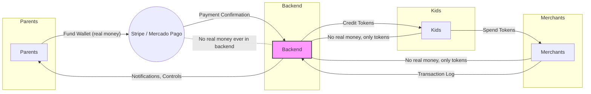

# ColePago/StudentWallet – Secure Architecture Diagram

---

**Key Security Highlight:**

- The backend never handles real money—only virtual tokens/coins.
- All real money is processed by Stripe/Mercado Pago (PCI-compliant providers).
- This ensures maximum safety for schools, parents, and kids.
