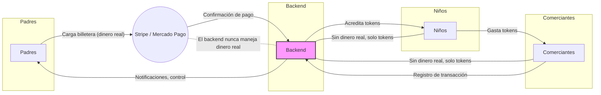

# ColePago/StudentWallet – Billetera Digital Segura para Escuelas

---

## ¿Cómo Funciona?

### 1. Los padres cargan la billetera

- El padre usa la app para cargar dinero a través de Stripe/Mercado Pago.
- **Ningún dato de tarjeta ni dinero real pasa por nuestro backend.**

### 2. Se acreditan tokens virtuales

- El backend recibe la confirmación del pago y acredita tokens/monedas virtuales a la billetera del niño.
- Solo tokens/monedas fluyen por el backend.

### 3. El niño gasta en la escuela

- El niño usa tokens para pagar en la cantina, tienda o actividades escolares.
- El padre recibe notificación instantánea.

### 4. Seguridad y Protección

- **IA: Detección facial y biometría:** Solo el niño autorizado accede a la billetera.
- **Sin exposición de dinero real:** Todo el dinero real es gestionado por proveedores PCI (Stripe/Mercado Pago).
- **Privacidad:** No se almacenan datos sensibles de pago en la app ni en el backend.

---

**ColePago/StudentWallet** – Seguro, inteligente y simple para familias y escuelas.

**Modelo de negocio:**
- ColePago obtiene una ganancia del 2% sobre cada transacción monetaria entrante (recarga de billetera).

Contacto: [tu-email@ejemplo.com]

© 2026 ColePago
# ColePago/StudentWallet – Diagrama de Arquitectura Segura

---

**Punto clave de seguridad:**
- El backend nunca maneja dinero real, solo tokens/monedas virtuales.
- Todo el dinero real es procesado por Stripe/Mercado Pago (proveedores PCI).
- Esto garantiza máxima seguridad para escuelas, padres y niños.
